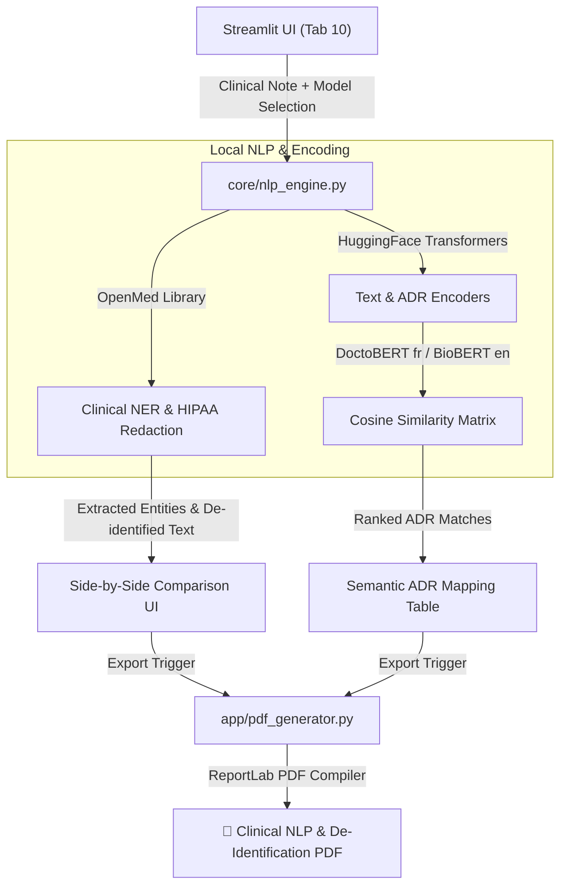

# Design Spec: Clinical NLP, PII De-Identification & DoctoBERT Semantic Mapping

This specification describes the design for the clinical Natural Language Processing (NLP) upgrades, HIPAA-compliant PII de-identification, semantic Adverse Drug Reaction (ADR) mapping using DoctoBERT/BioBERT, and the repository Git history purge.

---

## 1. Objectives & Use Cases

1. **Local-First Clinical NER & De-Identification:**
   - Integrate `openmed[hf]` to extract clinical entities (Drugs, Diseases, Anatomy, Dosage, Frequency) locally, preserving patient privacy.
   - Support HIPAA-compliant de-identification options (masking, realistic surrogate replacement, hashing, removal) with a side-by-side comparison UI.
2. **Semantic ADR Mapping (DoctoBERT / BioBERT):**
   - Provide an interface for calculating semantic similarity between unstructured clinical text and standard structured ADR terms (e.g., "Angioedema", "Acute Kidney Injury") used in the main VigiSignal-X disproportionality engine.
   - Support model selection: French `doctolib-lab/doctomodernbert-fr-base`, French `doctolib-lab/doctobert-fr-base`, and English `dmis-lab/biobert-v1.1`.
   - Enable multilingual safety analysis where French/English clinical notes can be semantically mapped to safety signals.
3. **Clean PDF Report Compilation:**
   - Update `app/pdf_generator.py` to allow exporting the parsed clinical entities, de-identified note, and mapped ADR similarities into a unified clinical audit PDF.
4. **Clean Repository State:**
    - Refactor the Git history of the repository to establish a clean initial commit state for the public open-source release.

---

## 2. Proposed Architecture & Components

### A. NLP Processing Engine (`core/nlp_engine.py`)
This new module will handle the NLP workload:
- **`analyze_and_deidentify(text: str, method: str) -> dict`**:
  Uses `openmed` to extract clinical entities and de-identify the text based on the selected method (`mask`, `replace`, `hash`, `remove`).
- **`calculate_adr_similarity(text: str, adrs: list, model_id: str) -> pd.DataFrame`**:
  Loads the selected encoder (DoctoBERT, BioBERT, or MiniLM) via `transformers` pipeline, computes embeddings for the text and the candidate ADRs, calculates cosine similarities, and returns a sorted DataFrame.

### B. NLP Presentation Layer (`app/nlp_tab.py`)
A new Streamlit UI tab rendering the following sections:
- **Input Area:** Text area for clinical notes (with a pre-loaded sample note in both English and French).
- **Control Panel:** Select box for de-identification method and dropdown for encoder model selection (DoctoBERT fr-base, DoctoModernBERT fr-base, BioBERT, MiniLM).
- **Results Panel:**
  - Side-by-side comparison of the original text with highlighted entities and the de-identified text.
  - A DataFrame/table of extracted clinical entities with confidence scores.
  - A ranked table of semantic similarity matches against standard cohort ADRs (Angioedema, Acute Kidney Injury, GI Haemorrhage, Hyperkalemia).
- **Export Action:** A button to export the NLP audit report as a PDF.

### C. PDF Generator Upgrades (`app/pdf_generator.py`)
Add a new function:
- **`generate_nlp_report_pdf(output_path, original_text, deidentified_text, entities_df, similarity_df, metadata)`**:
  Compiles a structured report including:
  - Original and de-identified text block.
  - Extracted clinical entities table.
  - Semantic ADR alignment table.

---

## 3. Git History Purge Process

To wipe out all historical commits (and any traces of personal files) on GitHub:
1. Delete the local `.git` directory to completely sever historical logs.
2. Initialize a fresh local repository with `git init`.
3. Set default branch to `main` with `git checkout -b main`.
4. Add all workspace files (respecting the `.gitignore` which prevents tracking of `strategy/`, local drafts, and `.ai_context.md`).
5. Commit all files under a single clean commit: `git commit -m "Initial commit: Open-source computational pharmacovigilance engine"`
6. Link the remote: `git remote add origin https://github.com/abdullah-pharmd/vigisignal-x.git`
7. Force-push to remote: `git push -u origin main --force`

This ensures a pristine GitHub page showcasing a clean, professional open-source project.

---

## 4. Verification & Testing Plan

### Automated Tests
Create `tests/test_nlp.py` to verify:
1. NER extraction logic runs and handles empty/typical cases.
2. De-identification replaces/masks PII according to configured rules.
3. Similarity calculations return correct dimensions and sorting.
*Note: Hugging Face model loads and inferences will be mocked during tests using `unittest.mock` to ensure tests run offline and fast without downloading large weights.*

### Manual Verification
1. Run `streamlit run app/main.py` and navigate to Tab 10.
2. Verify English and French sample text load and parse correctly.
3. Test that de-identified text updates dynamically when switching methods.
4. Test that semantic similarities align expected terms (e.g., "swelling of the airway" correlates to "Angioedema").
5. Compile and open the generated PDF report to verify alignment and typography.
